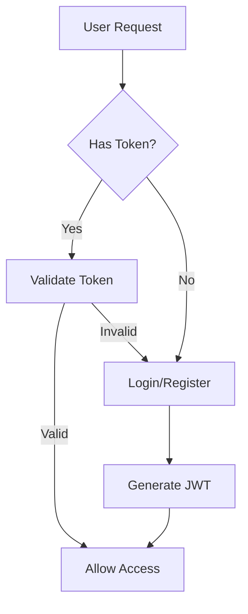
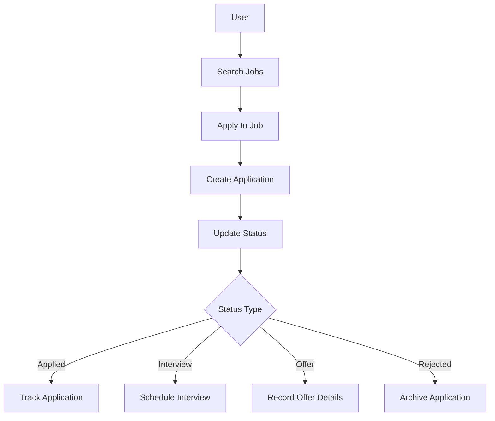
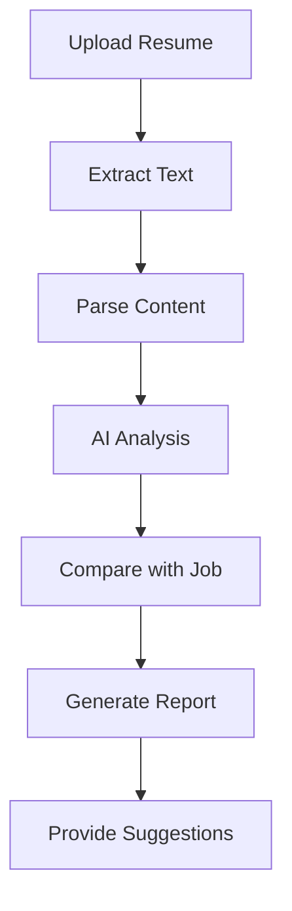
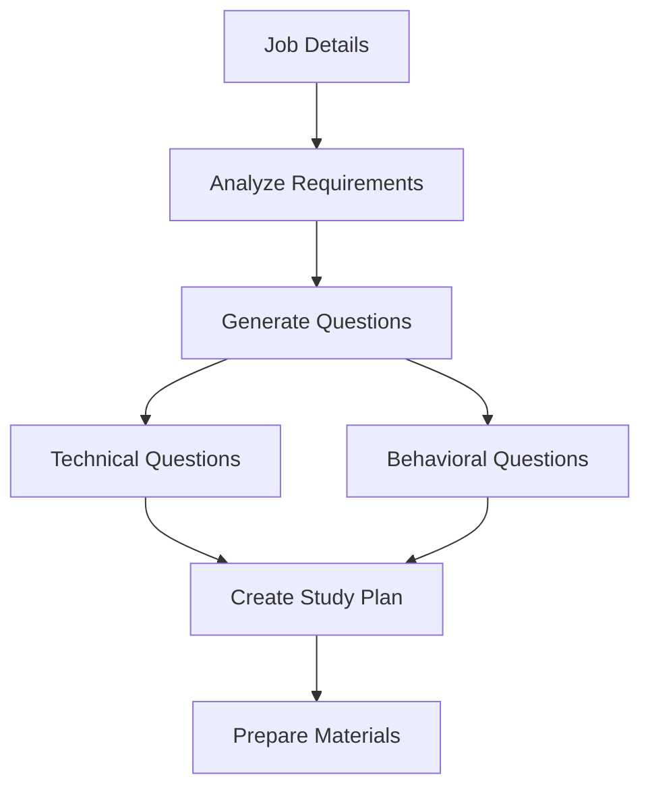
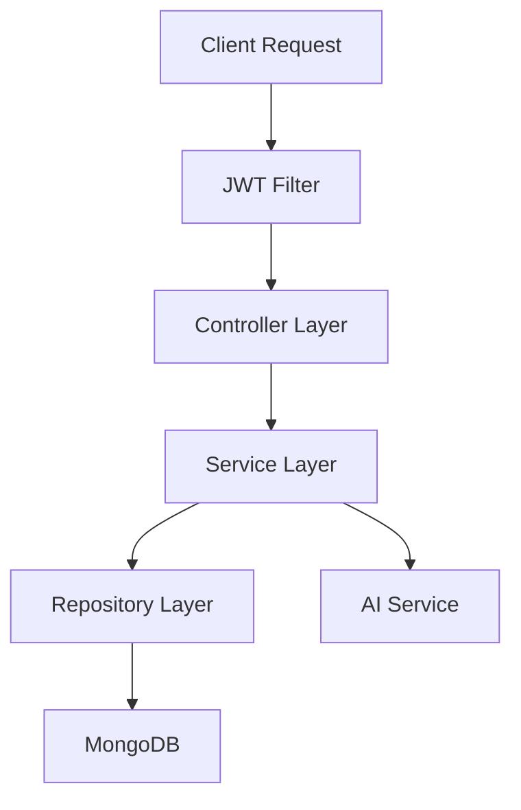
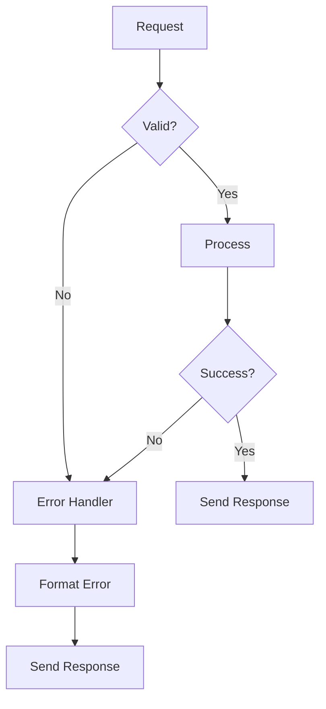

# Job Tracker Backend

A Spring Boot application that provides APIs for job application tracking, resume analysis, and interview preparation.

## Features

- User Authentication with JWT
- Job Application Management
- Resume ATS Analysis
- AI-Powered Interview Preparation
- Document Management
- Application Status Tracking

## Tech Stack

- Java 17
- Spring Boot 3.x
- MongoDB
- Spring Security with JWT
- OpenAI Integration
- Maven

## Prerequisites

- JDK 17 or higher
- MongoDB
- Maven
- OpenAI API Key

## Setup & Installation

1. Clone the repository:
```bash
git clone <repository-url>
cd job-tracker/backend
```

2. Configure application.properties:
```properties
# MongoDB Configuration
spring.data.mongodb.uri=your_mongodb_uri

# JWT Configuration
jwt.secret=your_jwt_secret
jwt.expiration=86400000

# OpenAI Configuration
ai.openai.api.key=your_openai_api_key
```

3. Build the project:
```bash
./mvnw clean install
```

4. Run the application:
```bash
./mvnw spring-boot:run
```

## API Endpoints

### Authentication
- POST /api/auth/register - Register new user
- POST /api/auth/authenticate - Login user

### Job Applications
- GET /api/applications - Get all applications
- POST /api/applications - Create new application
- PATCH /api/applications/{id}/status - Update application status
- POST /api/applications/{id}/interview - Schedule interview

### AI Features
- POST /api/ai/resume/analyze - Analyze resume
- POST /api/ai/interview/prepare - Generate interview prep

## Application Flow

### 1. Authentication Flow


### 2. Job Application Flow


### 3. Resume Analysis Flow


### 4. Interview Preparation Flow


### 5. Data Flow Architecture


## API Interaction Flow

### Authentication
1. User Registration:
   - Request hits `/api/auth/register`
   - Validate input
   - Hash password
   - Create user in database
   - Generate JWT
   - Return token

2. User Login:
   - Request hits `/api/auth/authenticate`
   - Validate credentials
   - Generate JWT
   - Return token

### Job Applications
1. Create Application:
   ```
   Request → Validation → Save to DB → Update Status → Send Response
   ```

2. Update Status:
   ```
   Request → Validate Status → Update DB → Create Activity → Send Response
   ```

   ### AI Integration
1. Resume Analysis:
   ```
   Upload → Extract → AI Analysis → Format Response → Save Results
   ```

2. Interview Prep:
   ```
   Job Details → Generate Questions → Create Materials → Save → Return
   ```

## Security Flow

### Request Authentication
```
Request → JWT Filter → Extract Token → Validate → Allow/Deny
```

### Authorization Flow
```
Validated Request → Check Permissions → Grant/Deny Access
```

## Error Handling Flow


## Event Handling
1. Application Status Change:
   - Update status
   - Create activity record
   - Send notification
   - Update statistics

2. Interview Scheduling:
   - Validate date
   - Update application
   - Create calendar event
   - Send confirmation

3. Document Processing:
   - Upload document
   - Process content
   - Store metadata
   - Link to application

## Data Processing Flow
1. Job Application:
   ```
   Raw Data → Validation → Formatting → Storage → Response
   ```

2. Resume Analysis:
   ```
   Upload → Text Extraction → AI Processing → Results → Storage
   ```

3. Interview Preparation:
   ```
   Requirements → AI Generation → Format → Storage → Delivery
   ```

## Integration Points
1. MongoDB Database
2. OpenAI API
3. Email Service (optional)
4. Document Storage
5. Frontend API

## Monitoring Flow
1. Request Logging
2. Error Tracking
3. Performance Metrics
4. User Activity
5. AI Usage Statistics
## Testing

Run tests using:
```bash
./mvnw test
```

## Security

- JWT-based authentication
- Password encryption using BCrypt
- Role-based authorization
- CORS configuration

## Database Schema

### User Collection
```json
{
    "id": "string",
    "email": "string",
    "password": "string",
    "firstName": "string",
    "lastName": "string",
    "role": "enum(USER, ADMIN)"
}
```

### JobApplication Collection
```json
{
    "id": "string",
    "userId": "string",
    "title": "string",
    "company": "string",
    "status": "enum(APPLIED, INTERVIEW, OFFER, REJECTED)",
    "appliedDate": "date",
    "interview": {
        "date": "date",
        "type": "string",
        "notes": "string"
    }
}
```

## Error Handling

The application includes global exception handling for:
- Invalid JWT
- User not found
- Invalid credentials
- AI service errors
- Database errors

## Deployment

1. Build JAR file:
```bash
./mvnw clean package
```

2. Run JAR file:
```bash
java -jar target/job-tracker-0.0.1-SNAPSHOT.jar
```

## Contributing

1. Fork the repository
2. Create feature branch
3. Commit changes
4. Push to branch
5. Create Pull Request
